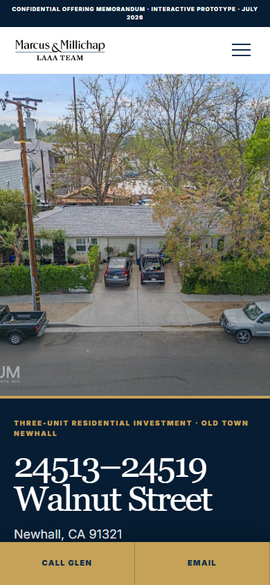
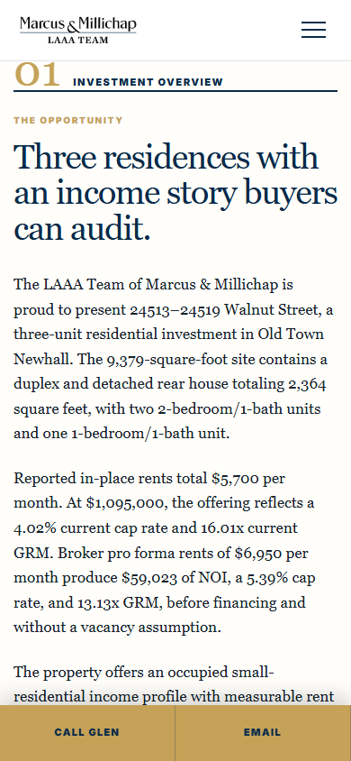
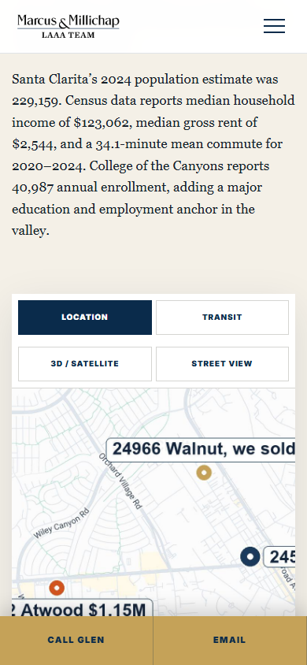
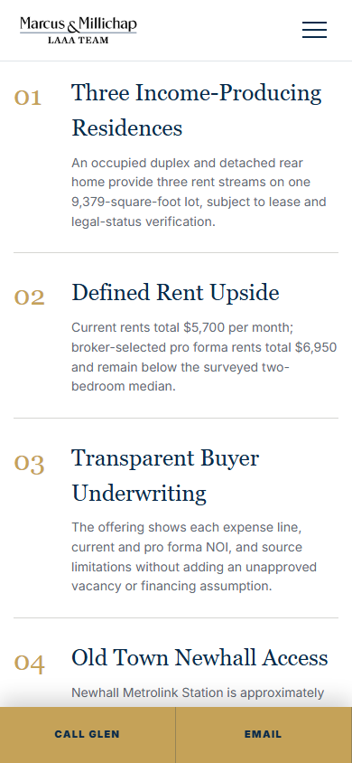
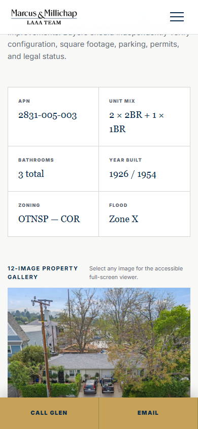
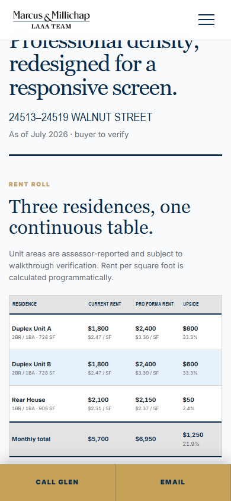
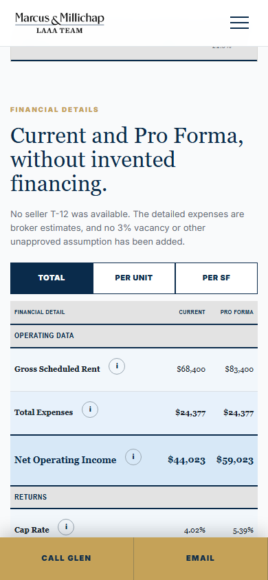
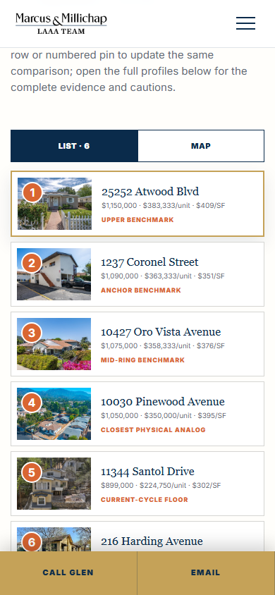
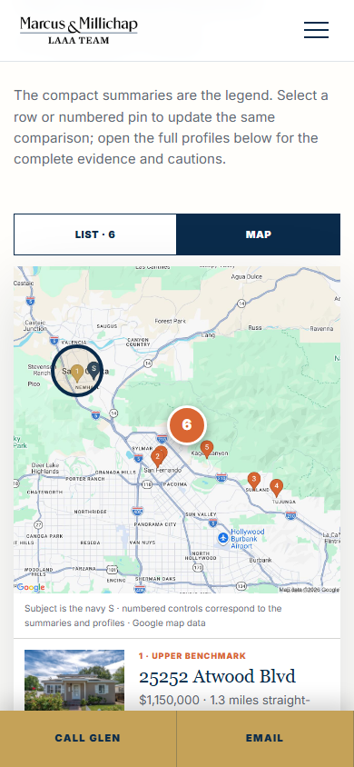

# Walnut OM phone review

Review-only screenshots from Walnut prototype source SHA
`a5b25a68107da1a6d8117993848c3da93a2f2a8a`.

This branch does not change PR #2, GitHub Pages, the live site, the custom domain,
or any release approval.

## 1. Hero and navigation



## 2. Investment Overview



## 3. Location Overview



## 4. Investment Highlights



## 5. Property Details and Gallery



## 6. Continuous Rent Roll



## 7. Financial Details



## 8. Comparable List



## 9. Comparable Map



## 10. Glen Scher profile


## 11. Filip Niculete profile


## Approval reply

```text
DESIGN: APPROVE / changes:
INVESTMENT COPY: APPROVE / changes:
LOCATION COPY: APPROVE / changes:
HIGHLIGHTS: APPROVE / changes:
MAPS: A (Google enhancement) or B (local fallback)
FINANCING: A (forthcoming) or B (provide inputs)
```
